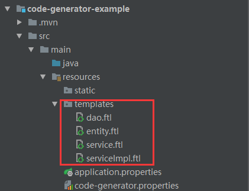

code-generator-maven-plugin
=================================
该插件为代码生成器插件，可以根据数据库表生成对应的entity、dao、service、serviceImpl、
Controller等方法。

## 一、还未完成的功能
1. mapper文件，controller的生成


## 二、使用方法
### 1. 配置code-generator.properties
```properties
#数据库连接相关
datasource.url=jdbc:mysql://localhost:3306/user?characterEncoding=utf8&useSSL=true
datasource.username=root
datasource.password=947568
datasource.driver-class-name=com.mysql.jdbc.Driver

#基本包名
codeGeneratorOption.basePackage=com.wolfjc.code.example
#需要生成的表，可以有多个，用逗号分开
codeGeneratorOption.TableConfig.tableNames=user,user_token
#对应生成的类名，可以有多个,用逗号分开,需与表的顺序一致
codeGeneratorOption.TableConfig.entityNames=User,UserToken
#每个类备注的作者名
codeGeneratorOption.author=wolfjc
#每个类备注的日期，若不填默认为当前时间（new Date）
codeGeneratorOption.dateTime=

```

### 2. pom中配置插件
```xml
<plugins>
    <plugin>
        <groupId>com.wolfjc.code.generator</groupId>
        <artifactId>code-generator-maven-plugin</artifactId>
        <version>1.0-SNAPSHOT</version>
        <configuration>
            <configPath>${basedir}/src/main/resources/code-generator.properties</configPath>
        </configuration>
    </plugin>
</plugins>
```

    configPath为code-generator.properties配置文件的地址

### 3.模板文件
在项目的resources目录下放入ftl模板文件
